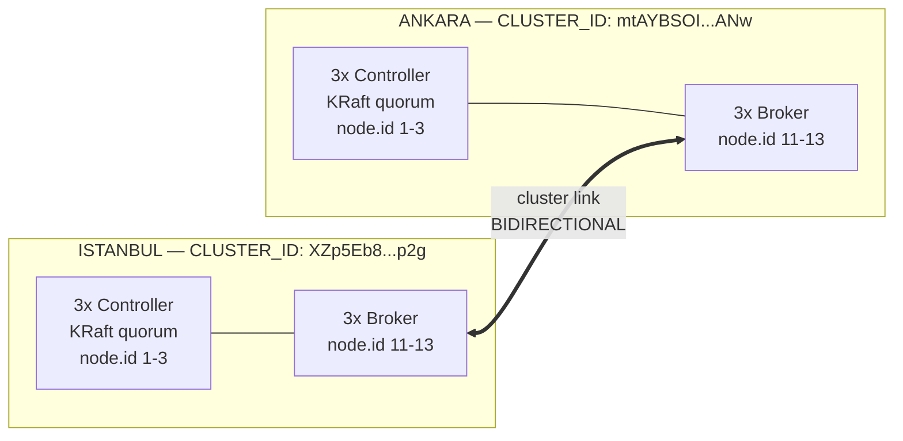
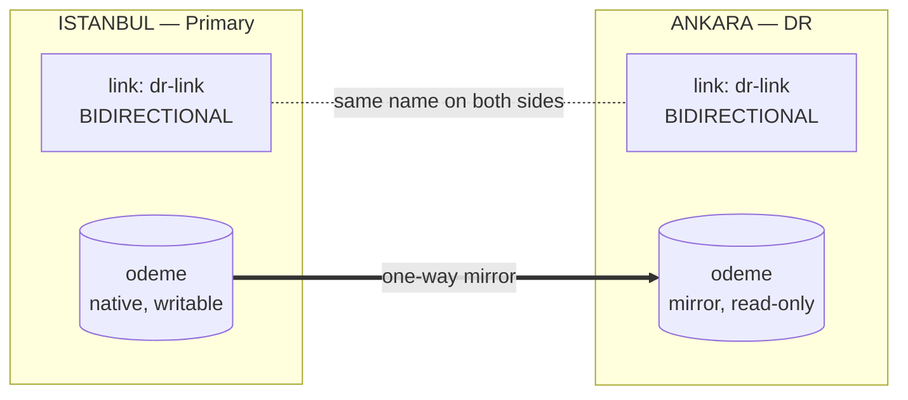
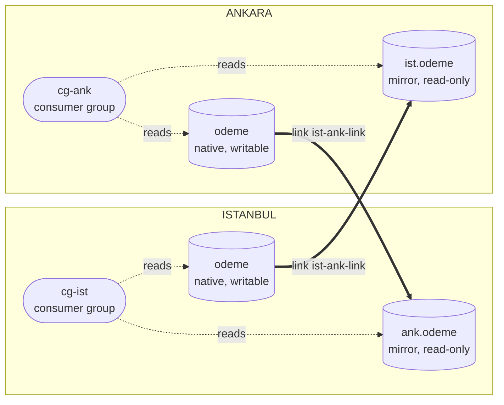

# Kafka Cluster Linking DR — Istanbul ⇄ Ankara

Spins up two independent Kafka clusters (Istanbul, Ankara), each with an isolated KRaft topology (3 controllers + 3 brokers), on Docker Compose — a sandbox for testing cross-region disaster recovery with Confluent Cluster Linking.

Two DR patterns are documented end to end, each with real command output captured from actual runs against this environment:

- **[Pattern A — Active/Passive](#pattern-a--activepassive-single-writable-topic)**: one writable topic, a read-only mirror on the DR side, and the classic `reverse-and-start` / `failover` / `truncate-and-restore` / `promote` lifecycle.
- **[Pattern B — Bidirectional](#pattern-b--bidirectional-both-sides-writable)**: both sides writable under prefixed mirrors, with regional consumer groups reading the union of local + mirrored data.

## Infrastructure



Brokers and controllers run as separate processes (isolated KRaft). This is required for the coordinator election mechanism that BIDIRECTIONAL cluster links depend on — combined mode (broker + controller in a single process) breaks that mechanism, leaving link creation and consumer offset sync permanently stuck.

The `Dockerfile` extends `confluentinc/cp-server:8.3.0` and bakes the cluster-link config files from `configs/` into the image under `/kafka-configs/` — so you don't need a separate `docker cp` step before creating links.

## Requirements

- Docker + Docker Compose v2

## Bringing Up the Environment

```bash
docker compose up -d
```

The `kafka-dr-node:local` image is built automatically on first run. Wait until all 12 containers are `healthy`:

```bash
docker compose ps
```

Both patterns below assume a clean environment. To switch between them, reset first with `docker compose down -v && docker compose up -d`.

## Choosing a Pattern

| | Pattern A — Active/Passive | Pattern B — Bidirectional |
|---|---|---|
| Writable topics | One side only | Both sides |
| Topic prefix | None | Required (`ist.` / `ank.`) |
| Consumer setup | Plain topic subscription | Regex subscription over local + mirror |
| Planned switchover | `reverse-and-start` (clean, no data truncation) | Not available — prefixed links don't support reversal |
| Disaster failover | `failover` → `truncate-and-restore` → `promote` | Redirect consumers to the surviving side |
| Consumers at failover | Repoint bootstrap; topic name unchanged | Repoint bootstrap **and** adjust the regex pattern |
| Best suited for | Classic DR where only one region serves writes | Active-active-ish setups, or staged regional migration |

A key constraint drives the split: `reverse-and-start` and `reverse-and-pause` are **not supported on cluster links configured with `cluster.link.prefix`**. Pattern A avoids prefixes and therefore gets the clean reversal workflow; Pattern B needs prefixes (both sides hold a topic named `odeme`, so mirrors must be renamed to coexist) and gives that workflow up.

---

# Pattern A — Active/Passive (single writable topic)

Istanbul owns the only writable `odeme`; Ankara holds a read-only mirror of the same name. The link is still created in BIDIRECTIONAL mode on both sides, because **failback only works with bidirectional links** — but only one mirror, in one direction, is created.



## A1. Setup

The bundled `configs/*.properties` files carry `cluster.link.prefix`, which Pattern A must not use — so write prefix-free configs and copy them in:

```bash
cat > ap-ist.properties <<'EOF'
link.mode=BIDIRECTIONAL
bootstrap.servers=ankara-broker-1:9092,ankara-broker-2:9092,ankara-broker-3:9092
consumer.offset.sync.enable=true
consumer.offset.sync.ms=5000
EOF

cat > ap-ank.properties <<'EOF'
link.mode=BIDIRECTIONAL
bootstrap.servers=istanbul-broker-1:9092,istanbul-broker-2:9092,istanbul-broker-3:9092
consumer.offset.sync.enable=true
consumer.offset.sync.ms=5000
EOF

docker cp ap-ist.properties istanbul-broker-1:/tmp/ap-link.properties
docker cp ap-ank.properties ankara-broker-1:/tmp/ap-link.properties
```

```bash
# 1) Native topic — Istanbul only
docker exec istanbul-broker-1 kafka-topics --bootstrap-server istanbul-broker-1:9092 --create --topic odeme --partitions 3 --replication-factor 3

# 2) Link on BOTH clusters, under the SAME name
docker exec istanbul-broker-1 kafka-cluster-links --bootstrap-server istanbul-broker-1:9092 --create --link dr-link --config-file /tmp/ap-link.properties --consumer-group-filters-json-file /kafka-configs/consumer-group-filters.json
docker exec ankara-broker-1 kafka-cluster-links --bootstrap-server ankara-broker-1:9092 --create --link dr-link --config-file /tmp/ap-link.properties --consumer-group-filters-json-file /kafka-configs/consumer-group-filters.json

# 3) Mirror — Ankara only, one direction
docker exec ankara-broker-1 kafka-mirrors --bootstrap-server ankara-broker-1:9092 --create --mirror-topic odeme --source-topic odeme --link dr-link
```

```
Created topic odeme.
Cluster link 'dr-link' creation successfully completed.
Cluster link 'dr-link' creation successfully completed.
Created topic odeme.
```

> **The link name must be byte-identical on both clusters.** If the names differ, the two link objects never pair up: the background offset-sync task keeps failing to find its counterpart and `--describe` reports `Remote link state: REMOTE_LINK_NOT_FOUND`, while mirror data flow appears to work fine — a silent, easy-to-miss breakage.

## A2. Steady state

```bash
printf 'msg-1\nmsg-2\nmsg-3\nmsg-4\nmsg-5\n' | docker exec -i istanbul-broker-1 kafka-console-producer --bootstrap-server istanbul-broker-1:9092 --topic odeme
docker exec ankara-broker-1 kafka-get-offsets --bootstrap-server ankara-broker-1:9092 --topic odeme
```

```
odeme:0:0
odeme:1:0
odeme:2:5
```

The mirror rejects writes — this is enforced by the broker, not by convention:

```bash
echo "test" | docker exec -i ankara-broker-1 kafka-console-producer --bootstrap-server ankara-broker-1:9092 --topic odeme
```

```
InvalidRequestException: Cannot append records to read-only mirror topic 'odeme'
```

```bash
docker exec ankara-broker-1 kafka-mirrors --bootstrap-server ankara-broker-1:9092 --describe --links dr-link --topics odeme
```

```
Topic: odeme  LinkName: dr-link  SourceTopic: odeme  State: ACTIVE
  SourceTopicId: yh5nKFdyTZCLMyOqozFD6Q   localTopicId: PGILGs7mQaGJdHLgKMU86A
  Partition: 0  LocalLogEndOffset: 0  LastFetchSourceHighWatermark: 0  Lag: 0
  Partition: 1  LocalLogEndOffset: 0  LastFetchSourceHighWatermark: 0  Lag: 0
  Partition: 2  LocalLogEndOffset: 5  LastFetchSourceHighWatermark: 5  Lag: 0
```

## A3. Planned switchover — `reverse-and-start` (preferred)

Use this when **both clusters are reachable**: maintenance windows, region migrations, scheduled DR drills. It flips the mirroring direction in place instead of tearing the relationship down, so no truncation and no topic re-creation are involved.

| | via `promote` | via `reverse-and-start` |
|---|---|---|
| Round-trip steps | 4 (promote → truncate-and-restore → promote → recreate mirror) | 2 (reverse → reverse) |
| Needs `truncate-and-restore` | Yes — **deletes divergent data** | No |
| Leftover-topic cleanup | Yes | No |
| Mirror relationship | Torn down, rebuilt by hand | Continues automatically, reversed |

Run it on whichever cluster currently **holds the mirror** — it "reverses the local mirror and starts the remote mirror". Note it takes `--topics` only; passing `--link` as well fails with `Cannot specify both --topics and --link.`

```bash
docker exec ankara-broker-1 kafka-mirrors --bootstrap-server ankara-broker-1:9092 --reverse-and-start --topics odeme
```

```
Request for reversing local mirror and starting remote mirror for topic odeme was successfully scheduled.
```

Ankara is now writable, and Istanbul has automatically become the mirror — nothing had to be run on Istanbul:

```bash
printf 'ankara-msg-1\nankara-msg-2\n' | docker exec -i ankara-broker-1 kafka-console-producer --bootstrap-server ankara-broker-1:9092 --topic odeme   # succeeds
docker exec istanbul-broker-1 kafka-mirrors --bootstrap-server istanbul-broker-1:9092 --describe --links dr-link --topics odeme
```

```
Topic: odeme  LinkName: dr-link  SourceTopic: odeme  State: ACTIVE
  SourceTopicId: PGILGs7mQaGJdHLgKMU86A   localTopicId: yh5nKFdyTZCLMyOqozFD6Q
  Partition: 2  LocalLogEndOffset: 7  LastFetchSourceHighWatermark: 7  Lag: 0
```

The two topic IDs have swapped roles compared to A2, and partition 2 already carries 7 records (5 original + 2 just written to Ankara) at `Lag: 0`.

Reversing back is symmetric — now Istanbul holds the mirror, so run it there:

```bash
docker exec istanbul-broker-1 kafka-mirrors --bootstrap-server istanbul-broker-1:9092 --reverse-and-start --topics odeme
printf 'istanbul-msg-6\n' | docker exec -i istanbul-broker-1 kafka-console-producer --bootstrap-server istanbul-broker-1:9092 --topic odeme   # succeeds

docker exec istanbul-broker-1 kafka-get-offsets --bootstrap-server istanbul-broker-1:9092 --topic odeme
docker exec ankara-broker-1 kafka-get-offsets --bootstrap-server ankara-broker-1:9092 --topic odeme
```

```
odeme:0:0   odeme:1:1   odeme:2:7     (Istanbul — primary again)
odeme:0:0   odeme:1:1   odeme:2:7     (Ankara — mirror again)
```

All 8 records survive the round trip identically on both sides. Nothing was truncated.

`--reverse-and-pause` is the same operation but leaves the remote mirror paused instead of started — useful when the other side is still under maintenance. Resume later with `--unpause`.

## A4. Disaster failover

When the primary is **gone**, reversal is impossible (it would need to start a mirror on the dead cluster). `--failover` is the only option; it converts the mirror immediately, with no checks against the unreachable source.

```bash
docker stop istanbul-broker-1 istanbul-broker-2 istanbul-broker-3 istanbul-controller-1 istanbul-controller-2 istanbul-controller-3
docker exec ankara-broker-1 kafka-mirrors --bootstrap-server ankara-broker-1:9092 --failover --topics odeme
```

```
Request for stopping topic odeme's mirror was successfully scheduled.
```

Ankara accepts writes from this point on:

```bash
printf 'dr-msg-1\ndr-msg-2\n' | docker exec -i ankara-broker-1 kafka-console-producer --bootstrap-server ankara-broker-1:9092 --topic odeme
docker exec ankara-broker-1 kafka-get-offsets --bootstrap-server ankara-broker-1:9092 --topic odeme
```

```
odeme:0:0
odeme:1:1
odeme:2:9
```

Redirect producers and consumers to Ankara. Since the topic name is unchanged, clients only need a new `bootstrap.servers`.

## A5. Failback

> ⚠️ **`truncate-and-restore` deletes data.** From the Confluent documentation: *"This command will also truncate and delete any divergent records that were produced to the original primary cluster after the point of failover."* Anything written to the primary in its final moments that never replicated — the RPO window — is destroyed by this command. The `0 messages will be truncated` seen below only reflects this specific test, where the primary had no unreplicated data. **Before running it in anger: identify the unreplicated records, export them, and get sign-off. Use `--include-partition-data` to preview exactly what will be discarded.**
>
> ⚠️ **Version advisory:** on Confluent Platform 7.9.0–7.9.2 and 8.0.0, `truncate-and-restore` against Tiered Storage topics can fail silently and cause data inconsistency or loss. Fixed in 7.9.3, 8.0.1 and 8.1.0+.

Bring the original primary back, then point it at the promoted DR cluster. Unlike the other verbs, this one requires **both** `--topics` and `--link`:

```bash
docker start istanbul-controller-1 istanbul-controller-2 istanbul-controller-3
docker start istanbul-broker-1 istanbul-broker-2 istanbul-broker-3

docker exec istanbul-broker-1 kafka-mirrors --bootstrap-server istanbul-broker-1:9092 --truncate-and-restore --topics odeme --link dr-link
```

```
Request for truncate and restore for topic odeme was successfully scheduled. 0 messages will be truncated.
```

```bash
docker exec istanbul-broker-1 kafka-mirrors --bootstrap-server istanbul-broker-1:9092 --describe --links dr-link --topics odeme
```

```
Topic: odeme  LinkName: dr-link  SourceTopic: odeme  State: ACTIVE
  Partition: 0  LocalLogEndOffset: 0  Lag: 0
  Partition: 1  LocalLogEndOffset: 1  Lag: 0
  Partition: 2  LocalLogEndOffset: 9  Lag: 0
```

Roles are now inverted: Ankara is the source, Istanbul mirrors it and has caught up to all 10 records. Once lag is zero, promote Istanbul back — `promote` verifies lag before converting, which `failover` does not:

```bash
docker exec istanbul-broker-1 kafka-mirrors --bootstrap-server istanbul-broker-1:9092 --promote --topics odeme
```

```
Calculating max offset and ms lag for mirror topics: [odeme]
Finished calculating max offset lag and max lag ms for mirror topics: [odeme]
Request for stopping topic odeme's mirror was successfully scheduled.
```

Finally, restore the original topology by recreating the mirror on Ankara. This is where a leftover topic bites:

```bash
docker exec ankara-broker-1 kafka-mirrors --bootstrap-server ankara-broker-1:9092 --create --mirror-topic odeme --source-topic odeme --link dr-link
```

```
Error while executing mirror command: Topic 'odeme' already exists.
```

Stopping a mirror does **not** delete the underlying topic — Ankara's promoted `odeme` is still sitting there as an ordinary topic and collides with the new mirror. Delete it, then retry:

```bash
docker exec ankara-broker-1 kafka-topics --bootstrap-server ankara-broker-1:9092 --delete --topic odeme
docker exec ankara-broker-1 kafka-mirrors --bootstrap-server ankara-broker-1:9092 --create --mirror-topic odeme --source-topic odeme --link dr-link

docker exec istanbul-broker-1 kafka-get-offsets --bootstrap-server istanbul-broker-1:9092 --topic odeme
docker exec ankara-broker-1 kafka-get-offsets --bootstrap-server ankara-broker-1:9092 --topic odeme
```

```
Created topic odeme.
odeme:0:0   odeme:1:1   odeme:2:9     (Istanbul — primary)
odeme:0:0   odeme:1:1   odeme:2:9     (Ankara — mirror)
```

Full circle, with all 10 records intact on both sides.

## A6. Command reference

| Verb | Flags | Run on | Requires source reachable |
|---|---|---|---|
| `--reverse-and-start` | `--topics` only | cluster holding the mirror | Yes (both sides) |
| `--reverse-and-pause` | `--topics` only | cluster holding the mirror | Yes (both sides) |
| `--failover` | `--topics` only | DR cluster | No |
| `--promote` | `--topics` only | cluster holding the mirror | Yes |
| `--truncate-and-restore` | `--topics` **and** `--link` | old primary | Yes |

---

# Pattern B — Bidirectional (both sides writable)

Both clusters own a writable topic named `odeme`, and each mirrors the other's under a prefix (`ist.` / `ank.`). Regional consumer groups subscribe by regex so they read local and mirrored data as one stream.



## B1. Setup

```bash
# 1) Native "odeme" topic on both clusters
docker exec istanbul-broker-1 kafka-topics --bootstrap-server istanbul-broker-1:9092 --create --topic odeme --partitions 3 --replication-factor 3
docker exec ankara-broker-1 kafka-topics --bootstrap-server ankara-broker-1:9092 --create --topic odeme --partitions 3 --replication-factor 3

# 2) BIDIRECTIONAL link (the link name MUST be identical on both sides —
#    otherwise consumer offset sync silently breaks with ClusterLinkNotFoundException)
docker exec istanbul-broker-1 kafka-cluster-links --bootstrap-server istanbul-broker-1:9092 --create --link ist-ank-link --config-file /kafka-configs/ist-side-link.properties --consumer-group-filters-json-file /kafka-configs/consumer-group-filters.json
docker exec ankara-broker-1 kafka-cluster-links --bootstrap-server ankara-broker-1:9092 --create --link ist-ank-link --config-file /kafka-configs/ank-side-link.properties --consumer-group-filters-json-file /kafka-configs/consumer-group-filters.json

# 3) Mirror topics
docker exec ankara-broker-1 kafka-mirrors --bootstrap-server ankara-broker-1:9092 --create --mirror-topic ist.odeme --source-topic odeme --link ist-ank-link
docker exec istanbul-broker-1 kafka-mirrors --bootstrap-server istanbul-broker-1:9092 --create --mirror-topic ank.odeme --source-topic odeme --link ist-ank-link

# 4) Verify
docker exec ankara-broker-1 kafka-mirrors --bootstrap-server ankara-broker-1:9092 --describe --links ist-ank-link --topics ist.odeme
```

## B2. DR failover test — consumer groups and offset continuity

This walkthrough continues from the setup above. It produces a small, easy-to-follow batch of messages on each side, sets up regional consumer groups, and then triggers a real outage to observe exactly how the system behaves — every command below was actually run against this environment and the output is copied verbatim.

### 1) Produce baseline traffic

```bash
printf 'ist-msg-1\nist-msg-2\nist-msg-3\nist-msg-4\nist-msg-5\nist-msg-6\nist-msg-7\nist-msg-8\nist-msg-9\nist-msg-10\n' | docker exec -i istanbul-broker-1 kafka-console-producer --bootstrap-server istanbul-broker-1:9092 --topic odeme
printf 'ank-msg-1\nank-msg-2\nank-msg-3\nank-msg-4\nank-msg-5\n' | docker exec -i ankara-broker-1 kafka-console-producer --bootstrap-server ankara-broker-1:9092 --topic odeme
```

10 messages land on Istanbul's native `odeme`, 5 on Ankara's. After a few seconds, both mirrors reflect this exactly:

```
$ docker exec ankara-broker-1 kafka-get-offsets --bootstrap-server ankara-broker-1:9092 --topic ist.odeme
ist.odeme:0:0
ist.odeme:1:0
ist.odeme:2:10

$ docker exec istanbul-broker-1 kafka-get-offsets --bootstrap-server istanbul-broker-1:9092 --topic ank.odeme
ank.odeme:0:5
ank.odeme:1:0
ank.odeme:2:0
```

### 2) Regional consumer groups read the union of native + mirror

```bash
docker exec istanbul-broker-1 kafka-console-consumer --bootstrap-server istanbul-broker-1:9092 --include 'odeme|ank\.odeme' --group cg-ist --from-beginning --timeout-ms 10000
docker exec ankara-broker-1 kafka-console-consumer --bootstrap-server ankara-broker-1:9092 --include 'odeme|ist\.odeme' --group cg-ank --from-beginning --timeout-ms 10000
```

Both report `Processed a total of 15 messages` (10 + 5) — each region already has a complete view of `odeme` regardless of where the data originated.

### 3) The interesting part: what does `kafka-consumer-groups --describe` show on *each* cluster?

```bash
docker exec istanbul-broker-1 kafka-consumer-groups --bootstrap-server istanbul-broker-1:9092 --describe --group cg-ist
docker exec ankara-broker-1 kafka-consumer-groups --bootstrap-server ankara-broker-1:9092 --describe --group cg-ist
docker exec ankara-broker-1 kafka-consumer-groups --bootstrap-server ankara-broker-1:9092 --describe --group cg-ank
docker exec istanbul-broker-1 kafka-consumer-groups --bootstrap-server istanbul-broker-1:9092 --describe --group cg-ank
```

```
=== cg-ist @ Istanbul (real consumer ran here) ===
GROUP   TOPIC       PARTITION  CURRENT-OFFSET  LOG-END-OFFSET  LAG
cg-ist  ank.odeme   0          5               5               0
cg-ist  odeme       2          10              10              0

=== cg-ist @ Ankara (no consumer ever ran here!) ===
GROUP   TOPIC       PARTITION  CURRENT-OFFSET  LOG-END-OFFSET  LAG
cg-ist  ist.odeme   2          10              10              0
cg-ist  odeme       0          5               5               0

=== cg-ank @ Ankara (real consumer ran here) ===
GROUP   TOPIC       PARTITION  CURRENT-OFFSET  LOG-END-OFFSET  LAG
cg-ank  ist.odeme   2          10              10              0
cg-ank  odeme       0          5               5               0

=== cg-ank @ Istanbul (no consumer ever ran here!) ===
GROUP   TOPIC       PARTITION  CURRENT-OFFSET  LOG-END-OFFSET  LAG
cg-ank  ank.odeme   0          5               5               0
cg-ank  odeme       2          10              10              0
```
(empty-offset partitions trimmed for readability)

Every group shows up on **both** clusters, even though each was only ever run once, on its own side. The cluster-link consumer offset sync mechanism does this **per linked topic pair, bidirectionally**: whichever end of a source↔mirror pair a group commits against, the offset is mirrored onto the other end automatically. `cg-ist` committed against Istanbul's native `odeme` (10) and Istanbul's `ank.odeme` mirror (5); both of those get projected onto Ankara as `ist.odeme` (10) and native `odeme` (5) respectively — with **zero consumer ever running on Ankara** for that group. The same is symmetrically true for `cg-ank`.

This has a real operational consequence: **group-name collisions across the two clusters are not cosmetic** — if two genuinely independent applications ever reused the same `group.id` on both sides, this mechanism would silently move each other's offsets. In this architecture it's a feature (an app's identity is deliberately the same on both sides so failover picks up seamlessly), but it demands strict naming discipline.

### 4) Trigger a real outage under live traffic

```bash
printf 'ist-msg-11\nist-msg-12\nist-msg-13\n' | docker exec -i istanbul-broker-1 kafka-console-producer --bootstrap-server istanbul-broker-1:9092 --topic odeme
sleep 8
docker exec ankara-broker-1 kafka-get-offsets --bootstrap-server ankara-broker-1:9092 --topic ist.odeme   # -> ist.odeme:2:13, confirms sync caught up

docker stop istanbul-broker-1 istanbul-broker-2 istanbul-broker-3 istanbul-controller-1 istanbul-controller-2 istanbul-controller-3
```

### 5) Redirect `cg-ist` to Ankara — same group, corrected topic pattern

Istanbul is down. `ank.odeme` doesn't exist on Ankara, so the pattern must switch from `odeme|ank\.odeme` to `odeme|ist\.odeme` — only the bootstrap address is not enough:

```bash
docker exec ankara-broker-1 kafka-console-consumer --bootstrap-server ankara-broker-1:9092 --include 'odeme|ist\.odeme' --group cg-ist --timeout-ms 10000
```

```
ist-msg-11
ist-msg-12
ist-msg-13
Processed a total of 3 messages
```

Exactly the 3 new messages — no replay of the original 10, no loss. `cg-ist` resumed from the offset that was already synced onto Ankara, with the same group identity, from a cluster it had never touched before this moment.

### 6) Bring Istanbul back — automatic catch-up, no manual intervention

```bash
docker start istanbul-controller-1 istanbul-controller-2 istanbul-controller-3
docker start istanbul-broker-1 istanbul-broker-2 istanbul-broker-3
```

Once healthy again, Istanbul's `ank.odeme` mirror automatically re-syncs anything that was written to Ankara while it was down — no operator action required beyond restarting the containers.

## Tearing Down

```bash
docker compose down -v
```

(`-v` also removes the volumes, for a fully clean restart.)

## Bundled Configs

- `configs/ist-side-link.properties` — link running on Istanbul: points at Ankara's brokers, defines the `ank.` prefix. **Pattern B only.**
- `configs/ank-side-link.properties` — link running on Ankara: points at Istanbul's brokers, defines the `ist.` prefix. **Pattern B only.**
- `configs/consumer-group-filters.json` — group filter (`*`, all groups) required whenever `consumer.offset.sync.enable=true`. Used by **both** patterns.

Pattern A deliberately uses prefix-free link configs written at runtime (see [A1](#a1-setup)), since a prefix would disable `reverse-and-start`.

## Gotchas Worth Knowing

These all surfaced while building and running the walkthroughs above:

1. **A bidirectional link needs two link objects sharing one name.** Different names on each side produce two unrelated unidirectional links; offset sync then fails with `REMOTE_LINK_NOT_FOUND` while mirror data keeps flowing, so the breakage is easy to miss.
2. **Isolated KRaft is mandatory.** Running broker and controller in one process breaks the cluster-link coordinator election — bidirectional links hang indefinitely and `promote`/`failover` get stuck in `PENDING_STOPPED`.
3. **`--topics` and `--link` are usually mutually exclusive.** `failover`, `promote`, `reverse-and-start` and `reverse-and-pause` take `--topics` alone; only `truncate-and-restore` wants both.
4. **`kafka-mirrors --describe` uses `--links` and `--topics`** (plural), not `--mirror-topic`, which is create-only.
5. **`consumer.offset.sync.enable=true` needs a separate JSON file.** The group filter can't live in the `.properties` file; pass `--consumer-group-filters-json-file` or link creation is rejected.
6. **Stopping a mirror doesn't delete the topic.** Rebuilding a mirror over a promoted topic fails with `Topic already exists` until the leftover is removed.
7. **`link state: ACTIVE` is not a liveness probe.** It stayed `ACTIVE` on the surviving cluster while the peer was fully stopped. Alert on mirror lag and on the freshness of `remote link state update time` instead.
8. **`docker exec` doesn't share the host filesystem.** Any file referenced by an in-container command must be `docker cp`'d in first — which is exactly why this repo bakes the configs into the image.

## References

- [Cluster Linking for Failover and Disaster Recovery](https://docs.confluent.io/cloud/current/multi-cloud/cluster-linking/dr-failover.html)
- [Manage Mirror Topics for Cluster Linking](https://docs.confluent.io/platform/current/multi-dc-deployments/cluster-linking/mirror-topics-cp.html)
- [Cluster Linking Commands](https://docs.confluent.io/platform/current/multi-dc-deployments/cluster-linking/commands.html)
- [Cluster Linking Configuration Options](https://docs.confluent.io/platform/current/multi-dc-deployments/cluster-linking/configs.html)
