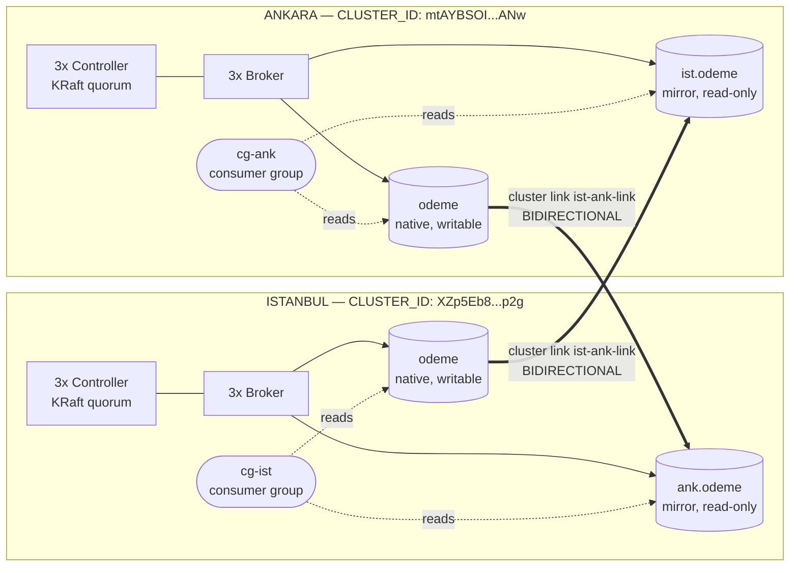

# Kafka Cluster Linking DR — Istanbul ⇄ Ankara

Spins up two independent Kafka clusters (Istanbul, Ankara), each with an isolated KRaft topology (3 controllers + 3 brokers), on Docker Compose. The goal is to provide a sandbox for testing a cross-region BIDIRECTIONAL mirror + DR failover architecture with Confluent Cluster Linking.

## Topology



Brokers and controllers run as separate processes (isolated KRaft) — this is required for the coordinator election mechanism that BIDIRECTIONAL cluster links depend on; combined mode (broker+controller in a single process) breaks that mechanism.

Each side runs a regex-subscribed consumer group (`cg-ist`, `cg-ank`) that reads the union of its own native topic and the mirror of the other side — so either region already has a complete, up-to-date view of `odeme`, ready to keep serving traffic if the other region goes down.

The `Dockerfile` extends `confluentinc/cp-server:8.3.0` and bakes the cluster-link config files from `configs/` into the image under `/kafka-configs/` — so you don't need a separate `docker cp` step before creating links.

## Requirements

- Docker + Docker Compose v2

## Bringing Up the Environment

```bash
docker compose up -d
```

The `kafka-dr-node:local` image is built automatically on first run. Wait until all 12 containers are `healthy`:

```bash
docker compose ps
```

## Quickstart — Native Topic + BIDIRECTIONAL Link + Mirror

```bash
# 1) Native "odeme" topic on both clusters
docker exec istanbul-broker-1 kafka-topics --bootstrap-server istanbul-broker-1:9092 --create --topic odeme --partitions 3 --replication-factor 3
docker exec ankara-broker-1 kafka-topics --bootstrap-server ankara-broker-1:9092 --create --topic odeme --partitions 3 --replication-factor 3

# 2) BIDIRECTIONAL link (the link name MUST be identical on both sides —
#    otherwise consumer offset sync silently breaks with ClusterLinkNotFoundException)
docker exec istanbul-broker-1 kafka-cluster-links --bootstrap-server istanbul-broker-1:9092 --create --link ist-ank-link --config-file /kafka-configs/ist-side-link.properties --consumer-group-filters-json-file /kafka-configs/consumer-group-filters.json
docker exec ankara-broker-1 kafka-cluster-links --bootstrap-server ankara-broker-1:9092 --create --link ist-ank-link --config-file /kafka-configs/ank-side-link.properties --consumer-group-filters-json-file /kafka-configs/consumer-group-filters.json

# 3) Mirror topics
docker exec ankara-broker-1 kafka-mirrors --bootstrap-server ankara-broker-1:9092 --create --mirror-topic ist.odeme --source-topic odeme --link ist-ank-link
docker exec istanbul-broker-1 kafka-mirrors --bootstrap-server istanbul-broker-1:9092 --create --mirror-topic ank.odeme --source-topic odeme --link ist-ank-link

# 4) Verify
docker exec ankara-broker-1 kafka-mirrors --bootstrap-server ankara-broker-1:9092 --describe --links ist-ank-link --topics ist.odeme
```

## DR Failover Test — Consumer Groups and Offset Continuity

This walkthrough continues from the Quickstart above (topics, link, and mirrors already created). It produces a small, easy-to-follow batch of messages on each side, sets up regional consumer groups, and then triggers a real outage to observe exactly how the system behaves — every command below was actually run against this environment and the output is copied verbatim.

### 1) Produce baseline traffic

```bash
printf 'ist-msg-1\nist-msg-2\nist-msg-3\nist-msg-4\nist-msg-5\nist-msg-6\nist-msg-7\nist-msg-8\nist-msg-9\nist-msg-10\n' | docker exec -i istanbul-broker-1 kafka-console-producer --bootstrap-server istanbul-broker-1:9092 --topic odeme
printf 'ank-msg-1\nank-msg-2\nank-msg-3\nank-msg-4\nank-msg-5\n' | docker exec -i ankara-broker-1 kafka-console-producer --bootstrap-server ankara-broker-1:9092 --topic odeme
```

10 messages land on Istanbul's native `odeme`, 5 on Ankara's. After a few seconds, both mirrors reflect this exactly:

```
$ docker exec ankara-broker-1 kafka-get-offsets --bootstrap-server ankara-broker-1:9092 --topic ist.odeme
ist.odeme:0:0
ist.odeme:1:0
ist.odeme:2:10

$ docker exec istanbul-broker-1 kafka-get-offsets --bootstrap-server istanbul-broker-1:9092 --topic ank.odeme
ank.odeme:0:5
ank.odeme:1:0
ank.odeme:2:0
```

### 2) Regional consumer groups read the union of native + mirror

```bash
docker exec istanbul-broker-1 kafka-console-consumer --bootstrap-server istanbul-broker-1:9092 --include 'odeme|ank\.odeme' --group cg-ist --from-beginning --timeout-ms 10000
docker exec ankara-broker-1 kafka-console-consumer --bootstrap-server ankara-broker-1:9092 --include 'odeme|ist\.odeme' --group cg-ank --from-beginning --timeout-ms 10000
```

Both report `Processed a total of 15 messages` (10 + 5) — each region already has a complete view of `odeme` regardless of where the data originated.

### 3) The interesting part: what does `kafka-consumer-groups --describe` show on *each* cluster?

```bash
docker exec istanbul-broker-1 kafka-consumer-groups --bootstrap-server istanbul-broker-1:9092 --describe --group cg-ist
docker exec ankara-broker-1 kafka-consumer-groups --bootstrap-server ankara-broker-1:9092 --describe --group cg-ist
docker exec ankara-broker-1 kafka-consumer-groups --bootstrap-server ankara-broker-1:9092 --describe --group cg-ank
docker exec istanbul-broker-1 kafka-consumer-groups --bootstrap-server istanbul-broker-1:9092 --describe --group cg-ank
```

```
=== cg-ist @ Istanbul (real consumer ran here) ===
GROUP   TOPIC       PARTITION  CURRENT-OFFSET  LOG-END-OFFSET  LAG
cg-ist  ank.odeme   0          5               5               0
cg-ist  odeme       2          10              10              0

=== cg-ist @ Ankara (no consumer ever ran here!) ===
GROUP   TOPIC       PARTITION  CURRENT-OFFSET  LOG-END-OFFSET  LAG
cg-ist  ist.odeme   2          10              10              0
cg-ist  odeme       0          5               5               0

=== cg-ank @ Ankara (real consumer ran here) ===
GROUP   TOPIC       PARTITION  CURRENT-OFFSET  LOG-END-OFFSET  LAG
cg-ank  ist.odeme   2          10              10              0
cg-ank  odeme       0          5               5               0

=== cg-ank @ Istanbul (no consumer ever ran here!) ===
GROUP   TOPIC       PARTITION  CURRENT-OFFSET  LOG-END-OFFSET  LAG
cg-ank  ank.odeme   0          5               5               0
cg-ank  odeme       2          10              10              0
```
(empty-offset partitions trimmed for readability)

Every group shows up on **both** clusters, even though each was only ever run once, on its own side. The cluster-link consumer offset sync mechanism does this **per linked topic pair, bidirectionally**: whichever end of a source↔mirror pair a group commits against, the offset is mirrored onto the other end automatically. `cg-ist` committed against Istanbul's native `odeme` (10) and Istanbul's `ank.odeme` mirror (5); both of those get projected onto Ankara as `ist.odeme` (10) and native `odeme` (5) respectively — with **zero consumer ever running on Ankara** for that group. The same is symmetrically true for `cg-ank`.

This has a real operational consequence: **group-name collisions across the two clusters are not cosmetic** — if two genuinely independent applications ever reused the same `group.id` on both sides, this mechanism would silently move each other's offsets. In this architecture it's a feature (an app's identity is deliberately the same on both sides so failover picks up seamlessly), but it demands strict naming discipline.

### 4) Trigger a real outage under live traffic

```bash
printf 'ist-msg-11\nist-msg-12\nist-msg-13\n' | docker exec -i istanbul-broker-1 kafka-console-producer --bootstrap-server istanbul-broker-1:9092 --topic odeme
sleep 8
docker exec ankara-broker-1 kafka-get-offsets --bootstrap-server ankara-broker-1:9092 --topic ist.odeme   # -> ist.odeme:2:13, confirms sync caught up

docker stop istanbul-broker-1 istanbul-broker-2 istanbul-broker-3 istanbul-controller-1 istanbul-controller-2 istanbul-controller-3
```

### 5) Redirect `cg-ist` to Ankara — same group, corrected topic pattern

Istanbul is down. `ank.odeme` doesn't exist on Ankara, so the pattern must switch from `odeme|ank\.odeme` to `odeme|ist\.odeme` — only the bootstrap address is not enough:

```bash
docker exec ankara-broker-1 kafka-console-consumer --bootstrap-server ankara-broker-1:9092 --include 'odeme|ist\.odeme' --group cg-ist --timeout-ms 10000
```

```
ist-msg-11
ist-msg-12
ist-msg-13
Processed a total of 3 messages
```

Exactly the 3 new messages — no replay of the original 10, no loss. `cg-ist` resumed from the offset that was already synced onto Ankara, with the same group identity, from a cluster it had never touched before this moment.

### 6) Bring Istanbul back — automatic catch-up, no manual intervention

```bash
docker start istanbul-controller-1 istanbul-controller-2 istanbul-controller-3
docker start istanbul-broker-1 istanbul-broker-2 istanbul-broker-3
```

Once healthy again, Istanbul's `ank.odeme` mirror automatically re-syncs anything that was written to Ankara while it was down — no operator action required beyond restarting the containers.

## Tearing Down

```bash
docker compose down -v
```

(`-v` also removes the volumes, for a fully clean restart.)

## Notes

- `configs/ist-side-link.properties` is for the link running on Istanbul: it points at Ankara's brokers and defines the `ank.` prefix.
- `configs/ank-side-link.properties` is for the link running on Ankara: it points at Istanbul's brokers and defines the `ist.` prefix.
- `configs/consumer-group-filters.json` defines the group filter (`*` — all groups) required by `consumer.offset.sync.enable=true`.
